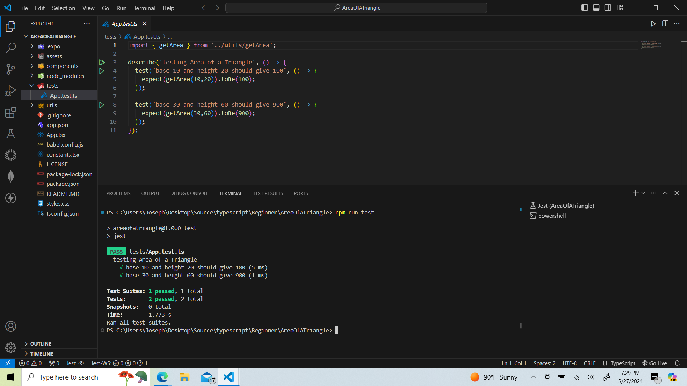

# Area Of A Triangle using Typescript

## Description
This app takes in float or int as radius, calculate the area of a square


## Authors

- [@jadogeri](https://www.github.com/jadogeri)

## Lab

-   


## Table of Contents

- [Screenshots](#screenshots)
- [Installation](#installation)
- [Tech Stack](#tech-stack)
- [Usage](#usage)
    -[Run Locally](#run-locally)
- [Tests](#tests)
- [About me](#about-me)
- [License](#license)
- [Credits](#credits)


## Screenshots

    | 

## Installation

Click on the link - [How to set up Typescript](https://www.typescriptlang.org/download/#:~:text=You%20can%20use%20npm%20to,latest%20version%20(currently%205.4))


## Tech Stack

**Client:** Jest, Typescript, Node

## Usage

### Run Locally

#### Get Project 

Get project by downloading from github or cloning the project.

1. Download from Github
. Navigate to project using link [Area of a Triangle Link](https://github.com/jadogeri/Typescript)
. Click on the code button.
. Choose the option Download Zip .
. Navigate to location where the zipped file was saved.
. Place cursor on file, right click using mouse then choose extract file.

Go to the project directory

```bash
   cd Typescript/Beginner/AreaOfATriangle
```

2. Clone the project 

```bash
  git clone https://github.com/jadogeri/Typescript.git
```

Go to the project directory

```bash
  cd Typescript/Beginner/AreaOfATriangle
```

### Start project

1. If Visual Studio Code has been installed, Open Visual Studio Code. If visual studio code is not installed , [Click Here](https://code.visualstudio.com/download).
2. On the top tab bar, select File --> Open Folder.
3. Navigate to location project was saved i.e Typescript/Beginner/areaofasquare.
4. Click on the button Select Folder.
5. On the top tab bar, Press Terminal --> New Terminal.
6. Type the command npm install to install packages to run 

```bash
  npm install
```
7. Type command below to start the application

```bash
  npm start
```

or

```bash
  npx expo start
```

## Tests

1. Type command below


```bash
  npm run test
```


## About Me  
🚀
I'm a Database Programmer learning Typescript to build mobile, web and cloud applications.


## License

[LICENSE](/LICENSE)

## Credits

 - [Awesome Readme Templates](https://awesomeopensource.com/project/elangosundar/awesome-README-templates)
 - [Awesome README](https://github.com/matiassingers/awesome-readme)
 - [How to write a Good readme](https://bulldogjob.com/news/449-how-to-write-a-good-readme-for-your-github-project)

 - [How to write Unit testing Jest in Typescript](https://www.youtube.com/watch?v=nBxd9tXeGjE)
